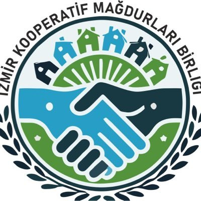

---

# BASIN AÇIKLAMASI VE CHP İZMİR İL BAŞKANINA AÇIK MEKTUP
#### 28.09.2024

CHP İzmir İl Başkanı şenol aslanoğlu, 25.09.2024 akşamı Ege TV’de yayınlanan bir programda Kentsel Dönüşüm Kooperatifleri hakkında bazı açıklamalarda bulundu. Yöneticilerin aylardır bir açıklama yapmadığı Kooperatif sorunuyla ilgili açıklamaları dikkatle izledik.

Bizler, **CHP’Lİ KOOPERATİF YÖNETİCİLERİNİN İDARE EDEMEDİĞİ VE ESKALASYON BATAĞINA SAPLADIĞI KOOPERATİFLERİN ORTAKLARI OLARAK** şenol aslaoğlunun açıklamalarına karşı isyan ediyoruz.

  
  

İlk olarak; şenol aslanoğlu konuşması sırasında “hak sahiplerine sözlerin verildiği 15-20 yıl öncesinde ekonomi iyi durumdayken…” derken 15-20 yıldır bir projeyi planlayamadıklarını ikrar etmiştir. KENDİSİNİN İDARESİNDE BULUNDUĞU KOOPERATİFLER DE DAHİL, BÜTÜN KOOPERATİFLERDE HÂLÂ PROJESİ TAMAMLANMAYAN YA DA İNŞAATI VAADEDİLEN AŞAMADA OLMAYAN PARSELLER BULUNMAKTADIR. YÖNETİMSEL YETERSİZLİKLER VE HATALAR SEBEBİYLE KOOPERATİF ÜYELERİ MADDİ ZARARA UĞRAMIŞTIR.

**BELEDİYEMİZİN ELİNDE HER TÜRLÜ PERSONEL, DONANIM VE TEKNİK İMKAN VARKEN, PLANLAMANIN TIKIR TIKIR İŞLEMESİ GEREKTİĞİ HALDE YILLARDIR NEDEN PROJELERİN ONAYLANMASINI BEKLEDİĞİMİZE HİÇ DEĞİNMEMİŞTİR.**

Beyefendinin “Olur mu olmaz mı? Oldurmuşlar” diye bahsettiği İzbeton ile Kooperatifler arasındaki SÖZLEŞMELER, KANUNA AYKIRI VE USULSÜZ ŞEKİLDE HAZIRLANMIŞTIR. Kentsel Dönüşüm adı altında kurulan, “Türkiye için örnek model” diye sunulan ve pazarlanan TÜM KOOPERATİFLERLE AYNI USULSÜZ sözleşme imzalanmıştır. İşin acı tarafı, **BÜTÜN KOOPERATİFLERDEKİ** **KURUCU ÜYELERİN TAMAMI, BU USULSÜZ SÖZLEŞMELERİ YAPARAK TÜM KOOPERATİF ÜYELERİNİ DAHA EN BAŞINDAN MAĞDURİYETE MAHKUM ETMİŞLERDİR.**

Bütün bunları bildiğiniz halde, usulsüz sözleşmelerin derhal düzeltilmesi için Bakanlık müfettişleri tarafından 2023 yılının Ağustos ayında yapılan YAZILI ihtara rağmen NEDEN HİÇ BİR SORUN YOKMUŞ GİBİ DAVRANDINIZ? Mesela GAZİEMİR İŞ İNSANLARI KY KOOPERATİFİNDE 2 YIL BOYUNCA YAPTIĞINIZ DETİM KURULU ÜYELİĞİNİZ 19.04.2024’E KADAR DEVAM ETTİĞİ HALDE YÖNETİM KURULUNUZA NEDEN SÖZLEŞMELERDEKİ USULSÜZLÜKTEN VE DÜZELTİLMESİ GEREKTİĞİNDEN BAHSETMEDİNİZ? CHP’NİN İZMİR İL TEMSİLCİĞİNİ DE BÖYLE Mİ YÜRÜTÜYORSUNUZ?

  
  

Kooperatif başkanının güvenilir olması gerektiği için kendisine başkanlık teklifi yapıldığını söylerken, şenol beyin İzmir’de aslanoğullarından daha güvenilir insan bulunmayacağını kast ettiğini sanıyoruz. Çünkü kendisi 28.11.2019’da SS İş Adamları KYK, 07.01.2022’de SS İş İnsanları Örnekköy KYK ve 20.06.2022’de SS İmece Yaka KY Kooperatiflerini kurarken abisi salim birol aslanoğlu ise 10.06.2022’de SS İş İnsanları Gaziemir KY Kooperatifini kurmuştur.

**Hal böyleyse “neden diğer 3 kentsel dönüşüm kooperatifini de siz kurmadınız sayın başkan?” diye kendisine sormak istiyoruz. BİR SİYASİ PARTİNİN İL BAŞKANININ KOOPERATİF KURMAKTAN DAHA ÖNEMLİ GÖREVLERİ OLMASI GEREKMEZ Mİ?**

**AYNI ANDA 2 KOOPERATİFTE OLMAMAYA DİKKAT EDEREK KAÇ KOOPERATİFİN YÖNETİM VE DENETİM KURULLARINDA GÖREV ALDINIZ sayın aslanoğlu? LÜTFEN CEVAP VERİN?**

**Bir önceki soruya cevap verebilir mi bilemeyiz ama AYNI TARİHLERDE HEM İŞ İNSANLARI ÖRNEKKÖY (4. ETAP) KYK HEM DE İŞ ADAMLARI KY KOOPERATİFİNDE şenol aslanoğlu’nun YÖNETİCİLİK YAPTIĞI TİCARET SİCİL GAZETESİNDE YAZIYOR. ÇOK FAZLA SAYIDA KOOPERATİF OLUNCA KARIŞTIRILIYOR MU YOKSA?**

İl başkanı olduktan sonra üyeliklerden çıktığını söyleyen şenol aslanoğlu’nun halen SS İmece Yaka KYK, SS Gaziemir İş İnsanları KYK ve SS İş Adamları KY Kooperatifinde üyeliği bulunmaktadır. Eşi duygu aslanoğlu’nun da SS İmece Yaka KYK’da ayrı bir üyeliği bulunmaktadır.

Lütfen cevaplayın sayın başkan. SİYASİ PARTİLERİN İL YÖNETİCİLERİNİN DE GÜVENİLİR OLMASI GEREKMİYOR MU?

**KAMUYU ALDATMAYI SİYASET SANANLARI HOŞ GÖRMEMİZİ HİÇ KİMSE BEKLEMESİN!**

  
  

Açıklamalarına bakarak şenol aslanoğlu’nun çalışma anlayışının, inşaatlar durdurulana kadar, “gerekli hızda çalışılması ve inşaatların vaad edildiği hızda ilerletilmesini” **kapsamadığını** anlıyoruz.

**İNŞAATLARIN SÖZ VERİLDİĞİ TARİHE YETİŞTİRİLMEMESİ SEBEBİYLE ESKALASYON YÜKÜNÜN BİZ ÜYELERİN ÜZERİNE BIRAKILMASI MAĞDURİYET DEĞİL MİDİR?**

Ülkece yaşadığımız bu ekonomik darboğazda, kooperatif vasıtasıyla bir ev sahibi olmak isteyen İzmirlilere bir darbe de işini zamanında ve doğru şekilde yapmamış yöneticiler atmıştır. Sizin için belki de önemi olmayan rakamlar, bizim için ağır maddi kayıptır sayın aslanoğlu.

şenol aslanoğlu’nun “Mağduriyet” kavramı belli ki çalışma(ma) anlayışından farklı değildir. Mutfağından, çocuğundan artırarak ev sahibi olmayı hayal etmiş halktan, belli ki çok uzaktır.

  
  

Kooperatif Yönetimleri sorularımızı ve eleştirilerimizi aylardır cevapsız bırakmaktalar. Yayında bahsettiğiniz hak ediş bilgilerini biz üyelere niçin vermiyorsunuz? Samimiyseniz, ortada henüz inşaat yokken taşeronlara verilen milyonlarca Lira avansın belgelerini bizden önce siz gösteriniz.

**YAŞATTIĞINIZ MAĞDURİYETLERE RAĞMEN BASINDA YAPTIĞINIZ AÇIKLAMALARDAN HİÇ Mİ UTANMIYORSUNUZ?**

  
  

Sorumluluk almaktan bu kadar uzak bir zihniyetin ne İzmir’e ne İl başkanlığına ne de siyaset kurumuna yakışmadığı aşikardır.

Oturduğunuz koltuk size ait değildir! VARLIĞINIZ, bir çoğumuzun oy ve gönül verdiği, ÜYESİ BULUNDUĞUNUZ PARTİYE ZARAR VERMEKTEDİR. **DERHAL SİYASETTEN İSTİFA ETMENİZİ** VE **KOOPERATİFLERİMİZDEN ELİNİZİ ÇEKMENİZİ** **KAMU HUZURUNDA TALEP EDİYORUZ.**

Son olarak;

şenol aslanoğlu’nun konuşması sırasında Kooperatif Modeli hakkındaki soruları sormak gerek dediği isimlerden açıklama bekliyoruz. TÜRKİYE’YE, İZMİR BÜYÜKŞEHİR BELEDİYESİ’NİN ÖRNEK MODELİ OLARAK SUNULAN VE BELEDİYENİN İŞTİRAKİ OLAN İZBETON DENETİMİNDE YAPILACAĞI VE 33 AYDA TESLİM EDİLECEĞİ SÖYLENEN KONUTLAR İÇİN KURULAN KOOPERATİFLER, NASIL OLUYOR DA DAHA KURULUR KURULMAZ KANUNA AYKIRI VE USULSÜZ SÖZLEŞMELER YAPABİLİYOR?

BU SORUYU **TUNÇ SOYER** BAŞTA OLMAK ÜZERE, PARTİNİN ESKİ VE YENİ ÜST DÜZEY YÖNETİCİLERİ **KEMAL KILIÇDAROĞLU** İLE **ÖZGÜR ÖZEL**’E, ADLARI İL BAŞKANLARI TARAFINDAN ZİKREDİLEN DİĞER PARTİLİLERİ **SELİN SAYEK BÖKE**’YE, **OĞUZ KAAN SALICI**’YA VE **AHMET AKIN**’A SORUYORUZ.

**5.000 AİLE, MERAKLA SİZLERDEN GELECEK CEVABI BEKLİYORUZ.**

ÜYELERE KARŞI VERECEĞİNİZ YA DA VERMEYECEĞİNİZ CEVAPLAR İLE HER BİRİNİZİN TUTUMUNU HASSASİYETLE TAKİP ETMEKTEYİZ.

Kamuoyuna saygılarımızla sunarız.

### İzmir Kooperatif Mağdurları Birliği

  

  
  

###### Not: Metinde yer alan iddialara ilişkin belgelere [buradan](https://github.com/koopbirlik/koopbirlik.github.io/tree/main/belgeler) ulaşabilirsiniz.
